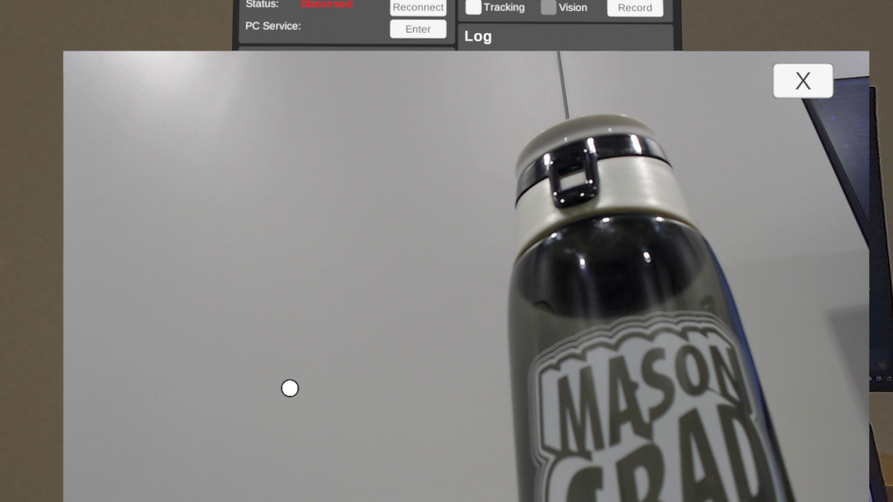
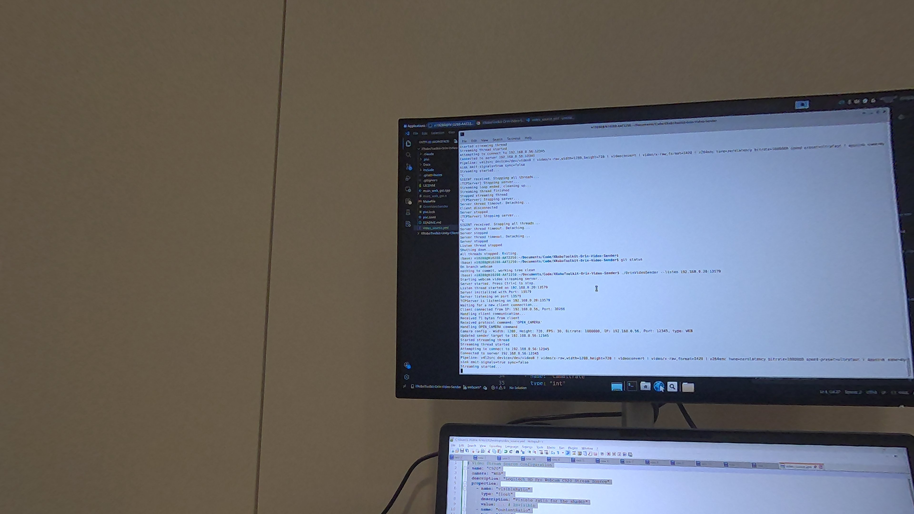

# XRoboToolkit-Orin-Video-Sender
Webcam Video Previewer/Encoder/Sender on Linux (x86_64 / aarch64).

> Developed and tested using `Logitech HD Pro Webcam C920`.

<table>
<tr>
<td><br/><sub>Mono webcam (Available)</sub></td>
<td><br/><sub>Stereo webcam (Invisible as "visibleRatio = 0")</sub></td>
</tr>
</table>

> Note: Press B button on right-hand controller to switch.

## Features

- Webcam capture via V4L2
- Local video preview (`--preview`)
- H.264 encoding via GStreamer (x264enc software encoder)
- TCP video streaming (`--send`)
- Remote control via TCP commands (`--listen`)
  - Supports `OPEN_CAMERA` / `CLOSE_CAMERA` protocol commands

## Install and Build

### On PC
- [Pixi](https://pixi.sh) package manager recommended
```bash
curl -fsSL https://pixi.sh/install.sh | bash
source ~/.bashrc
pixi install
```

This installs all dependencies (GStreamer, glib, x264, etc.) from conda-forge.
Then build using:

```bash
pixi run clean && pixi run build
```

### On G1
- Using system packages

```bash
sudo apt-get install libgstreamer1.0-dev libgstreamer-plugins-base1.0-dev \
    gstreamer1.0-plugins-good gstreamer1.0-plugins-ugly gstreamer1.0-x
sudo usermod -aG video $USER  # then log out and back in
```
Then build using:

```bash
make clean && make orin
```


## Usage

```bash
./OrinVideoSender --help
```

### Preview only

```bash
./OrinVideoSender --preview
```

### Linux Firewall Issue

Allow port 12345 (send) and 13579 (listen)
```bash
sudo ufw allow 12345
sudo ufw allow 13579
```

### Direct send 

```bash
# 192.168.0.46 is the receiver IP (Headset)

# On PC (with optional preview)
./OrinVideoSender --send --server 192.168.0.46 --port 12345 --preview --camera mono
# or (default camera typeis mono)
./OrinVideoSender --send --server 192.168.0.46 --port 12345 --preview

# On G1, do not use --preview
./OrinVideoSender --send --server 192.168.0.46 --port 12345  --camera stereo
```

- Note: The B button on right-hand controller to switch vision mode:
- when --camera mono, show or hide the preview window.
- when --camera stereo, enable or disable the VR view.

### Listen mode (remote control)

Waits for `OPEN_CAMERA` / `CLOSE_CAMERA` commands from a remote client (Headset).

```bash
# 192.168.0.20:13579 is the address to listen on (where the camera connects and the target ip address input in headset.)
./OrinVideoSender --listen 192.168.0.20:13579
./OrinVideoSender --listen 192.168.0.20:13579 --preview
```

## Copy Config File

- Download `video_source.yml` file

- PICO Headset

```bash
adb push video_source.yml /sdcard/Android/data/com.tsxrobotoolkit.client/files/
```


- Run the Unity Client in Headset

## Default Webcam Resolutions (C920)

| Resolution | FPS | Notes   |
| ---------- | --- | ------- |
| 1280x720   | 30  | Default |

## Related Projects

- [Video-Viewer](https://github.com/XR-Robotics/XRoboToolkit-Native-Video-Viewer) - H.264 stream receiver [TCP/UDP]
- [VideoPlayer](https://github.com/XR-Robotics/RobotVision-PC/tree/main/VideoTransferPC/VideoPlayer) - H.264 stream receiver [TCP Only]
- [Unity-Client](https://github.com/XR-Robotics/XRoboToolkit-Unity-Client) - Unity H.264 stream receiver [TCP Only]
- [Unity-Client-Quest](https://github.com/XR-Robotics/XRoboToolkit-Unity-Client-Quest) - Unity H.264 stream receiver [TCP Only]
- [RobotVisionTest](https://github.com/XR-Robotics/RobotVision-PC/tree/main/VideoTransferPC/RobotVisionTest) - FFmpeg software encoding reference
